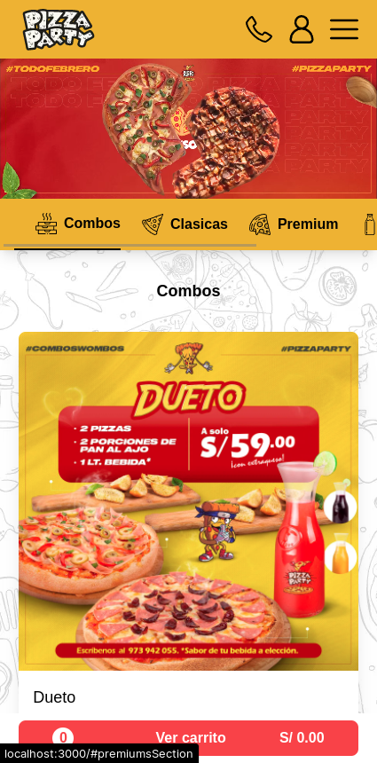
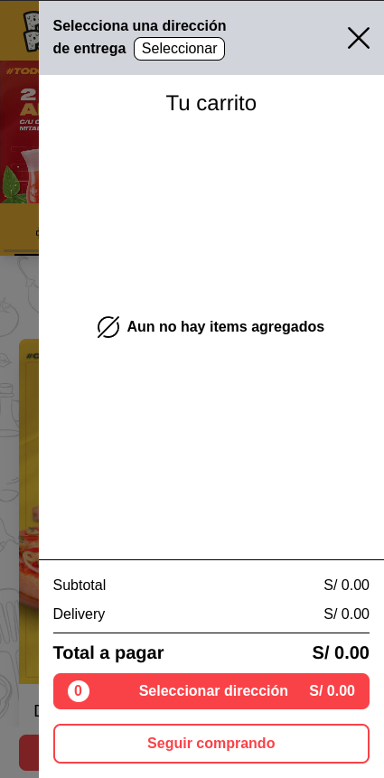
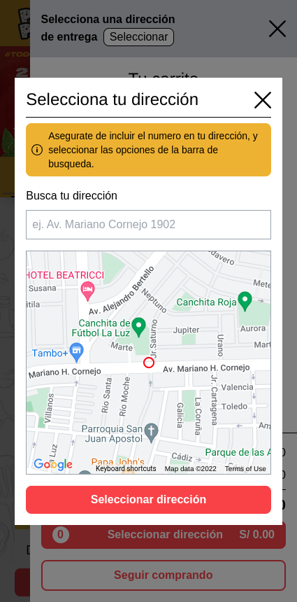
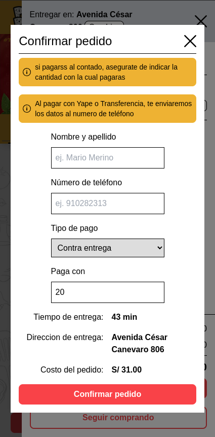
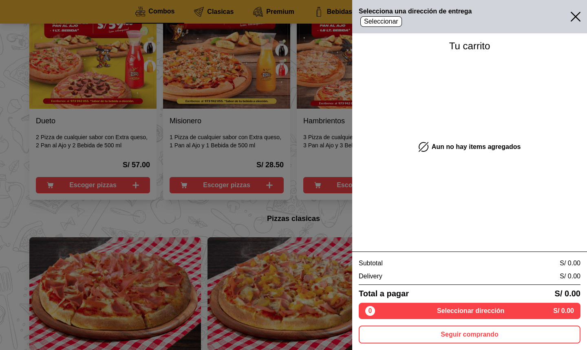
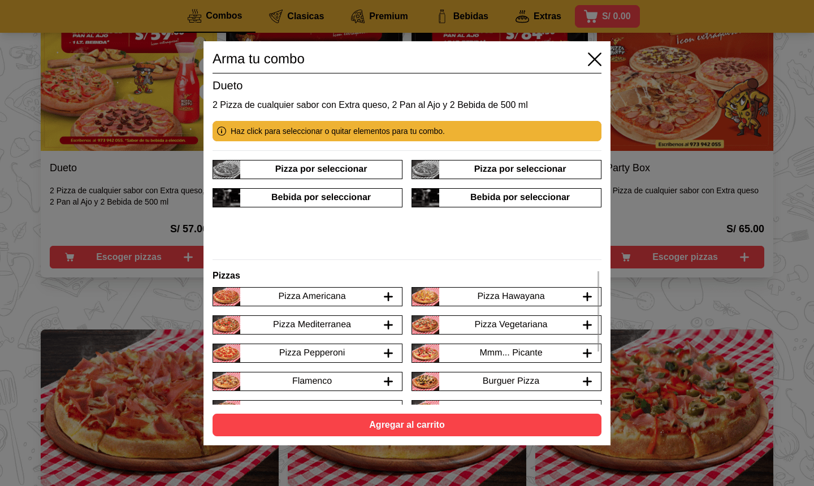
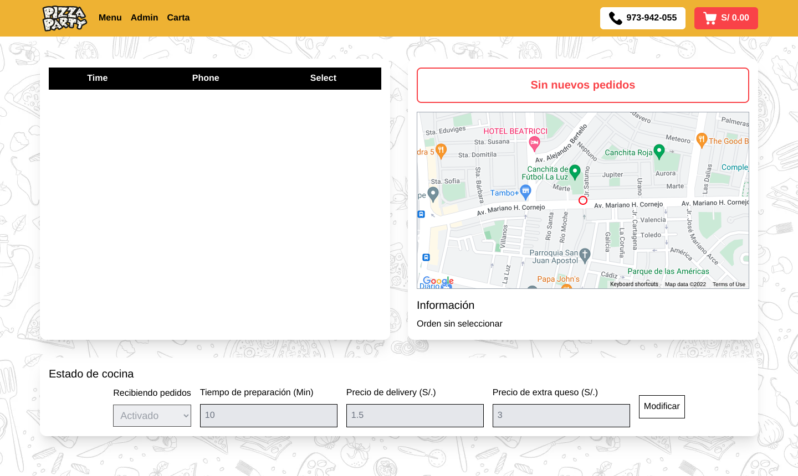

# Pizza Party Webapp

A web application to manage `delivery` pizza orders, with custom styles and `admin page`, made for the Pizza Party Restaurant.

## Table of Contents

- [Pizza Party Webapp](#pizza-party-webapp)
  - [Table of Contents](#table-of-contents)
  - [Objectives](#objectives)
  - [Technologies](#technologies)
  - [Screenshots](#screenshots)
  - [Installation](#installation)
  - [References](#references)

## Objectives

This project was made to have a web based solution for helping the customers with the `ordering process` of the different available items in the restaurant menu, and based on their address data, show them relevant information about the `delivery time` and prices to let them decide if the order fulfill their requirements.

## Technologies

Some of the technologies that were used to build this project.

- [Vue.js](https://vuejs.org/)
- [Firebase](https://firebase.google.com/?hl=es-419)
- [Google Maps Api](https://developers.google.com/maps/documentation/javascript)

<div style="display:flex;justify-content:center;gap:16px">

  
  
  
</div>

## Screenshots

Some of the main views of the project.

- Mobile views

<div style="display:grid;grid-template-columns:1fr 1fr 1fr 1fr;gap:2rem">









</div>

- Desktop views

<div style="display:grid;grid-template-columns:1fr 1fr;gap:2rem">








</div>

## Installation

```bash
# bash
# Install the dependencies
$ npm install
# Start developtment server
$ npm run dev
# Build project and generate static files
$ npm run build
# View generated files
$ npm run serve
```

For more details, you can check [Vite docs](https://vitejs.dev/guide/build.html)

## References

The documentation sites and other resources that help with the project.

- [Firebase Docs](https://firebase.google.com/docs)
- [Maps Api Docs](https://developers.google.com/maps/documentation/javascript)
